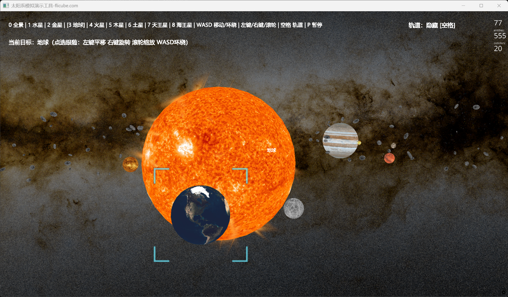
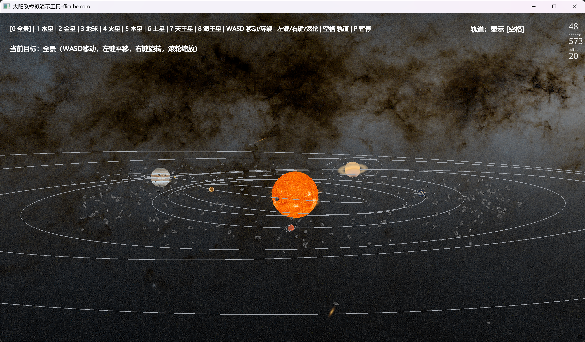

# AI生成-太阳系模拟演示系统

一个基于 **Python + Ursina** 的 3D 太阳系演示项目，提供太阳、八大行星、主要卫星、小行星带、随机飞入小行星、背景星空以及多种镜头交互方式，适合用于演示、展示和基础教学场景。

项目地址：
- https://github.com/pxzleo/solar-system-simulation-tool

## 预览截图





## 功能特性

- 太阳、八大行星与主要卫星的 3D 可视化演示
- 行星公转、自转，卫星同步自转
- 土星环、地球云层/夜光层、太阳火焰与光晕效果
- 主小行星带与随机飞入小行星
- 星空全景背景与多视角观察
- 支持总览、点选跟随、自由观察等镜头模式
- 支持暂停 / 恢复动画

## 运行环境

- Python 3.11+

## 本地运行

```bash
python solar_system_3d.py
```

自动关闭测试：

```bash
python solar_system_3d.py --auto-close 5
```

## 主要控制

- `0`：全景模式
- `1 ~ 8`：快速切换到各主要行星视角
- `空格`：显示 / 隐藏轨道
- `P`：暂停 / 恢复动画
- `WASD`：移动 / 环绕（视当前镜头模式而定）
- 鼠标左键：平移
- 鼠标右键：旋转视角
- 鼠标滚轮：缩放
- 鼠标单击星体：选中并跟随
- 鼠标单击空白处：取消选中

## Windows 可执行版本

打包后主程序位置：

```text
dist\SolarSystem3D\SolarSystem3D.exe
```

发布或拷贝时请保留整个目录：

- `SolarSystem3D.exe`
- `_internal/`

GitHub Release 下载：
- https://github.com/pxzleo/solar-system-simulation-tool/releases/tag/v0.2.1

## 项目说明

- 本项目偏向“视觉演示效果 + 部分真实数据参考”，不是严格的天体物理模拟器。
- 部分贴图、距离和速度已做视觉压缩，以保证整体展示效果更直观。
